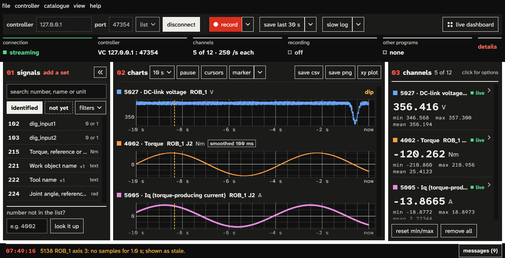
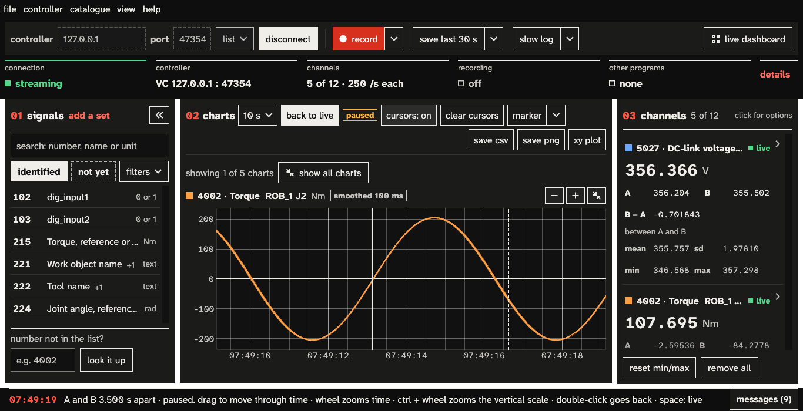
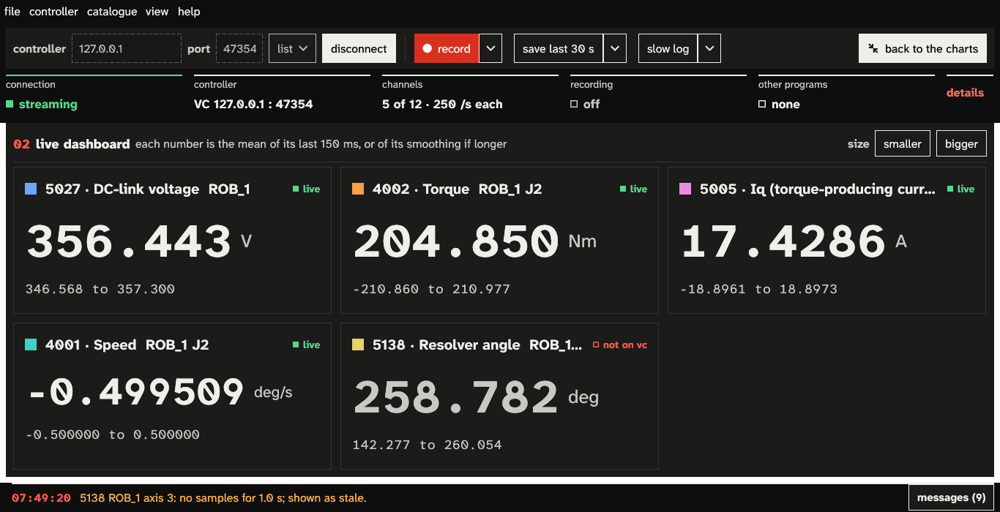

# ABB Signal Spy

A small Windows app for seeing what an ABB IRC5 is really doing. It reads the motion test signals the
controller streams over RobAPI InfoStream (motor currents and torques, DC-link voltage, resolver angles,
joint speeds and a few hundred more), charts them live and records them.

It only ever reads. No motion, no RAPID, no config or I/O writes, no mastership.

## Get it

Grab the latest `.exe` from [Releases](../../releases). No installer, just run it. Windows 10 or 11.

## Use it

1. Type the controller's address and hit **connect**. RobotStudio virtual controllers show up under **list**.
2. Pick signals on the left and **add** them, up to 12.
3. Watch them live, hit **record** before something happens, or **save last** right after it did.

Close TuneMaster's signal logging and RobotStudio's signal tools first. The controller streams to one
program at a time, and Signal Spy tells you when someone else is on it instead of fighting over it.

Space pauses, and two cursors measure anything on the charts:

Or switch to the **live dashboard** for big numbers you can read from across the cell:

Recordings go to `Documents\TestSignals`, one folder each: a plain `data.csv`
(`controller_ms,channel,value`) plus a `recording.json` with the details. **file > open a recording**
brings one back up.

The built-in signal list was measured on an IRB 2600 with RobotWare 6.16. Other robots or versions may
number things differently.

## Build it

Rust 1.95 or newer with MSVC: `cargo build --release`.

## License

Copyright (C) 2026 Jon Sands. GPL-3.0-or-later, see [LICENSE](LICENSE).
Not affiliated with ABB; ABB and IRC5 are ABB's trademarks.
