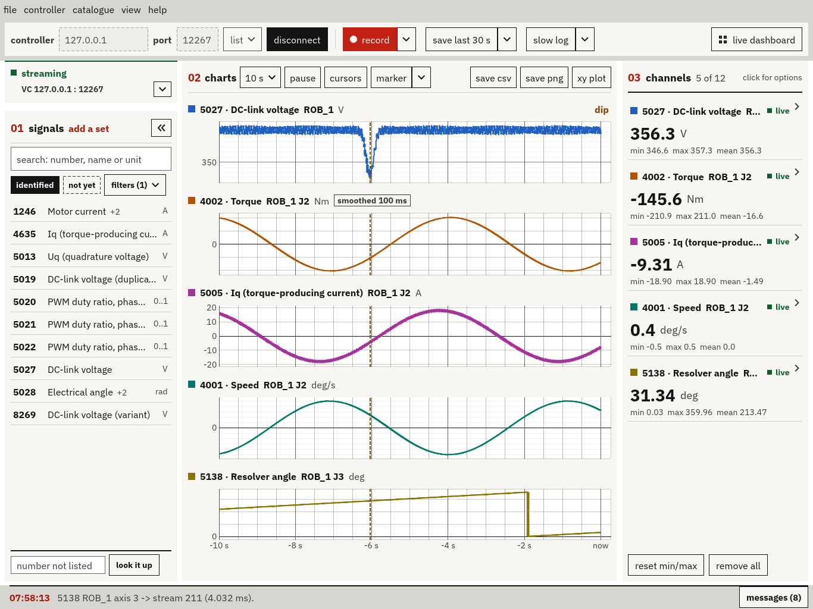

# ABB Signal Spy

Windows application for seeing what an ABB IRC5 based robot system is really doing. It reads the motion test signals the
controller streams over RobAPI InfoStream (motor currents and torques, DC-link voltage, resolver angles,
joint speeds and a few hundred more), charts them live and records them. UI optimized for in-field use on shitty laptop screens

Currently working fully with IRC5 / RW6 based cells. Works on the Service, LAN, or WAN ports of the controller. Can be made to work on RW7 / Omnicore, but I'd need someone with access to one to gather some data for me (Virtual RW7 controllers are not enough).

It only ever reads. No motion, no RAPID, no config or I/O writes, no controller mastership grant required.

## Hidden Figures

The core reason I built this: It exposes more than 150 diagnostic signals that TuneMaster or RobotStudio will not show you - including raw resolver angles and other values needed to commutate robot servo motors (ABB, why did you only make these officially available for external axis? You made me build this)

| Signals | Count |
|:--|--:|
| In the catalogue | **407** |
| Documented by ABB (the ones TuneMaster offers) | 57 |
| Hidden, but now defined and identified | ~150 |
| Discovered, not yet identified (maybe you can?) | ~200 |  

## Get it

Grab the latest `.exe` from [Releases](../../releases). No installer, just run it. Windows 10 or 11; for Windows 7 (64-bit), take the one ending in `-win7`.

## Use it

1. Enter the controller's address and hit **connect**. RobotStudio virtual controllers show up under **list**.
2. Pick signals on the left and **add** them, up to 12 at once.
3. Watch them live, hit **record** before something happens, or **save last** right after it did.

If they're running, close TuneMaster's signal logging and RobotStudio's signal tools first. The controller will stream signals to one
consumer at a time only, and Signal Spy tells you when someone else is on it instead of fighting over it.

Spacebar pauses, add cursors to measure anything on the chart, zoom in and out, change scale, make the chosen chart full screen, etc:

Or switch to the **live dashboard** for big numbers you can read from across the cell:

Light theme also available: uncheck **dark** under **view**.

Recordings go to `Documents\TestSignals`, one folder each: a plain `data.csv`
(`controller_ms,channel,value`) plus a `recording.json` with the details. **file > open a recording**
brings one back up.

The built-in signal list was measured on an IRB 2600 with RobotWare 6.16. Other robots or versions may
number things differently, but the identified signals should be correct - the unidentified signals are most likely model specific things, or Omnicore/RW7 specific.

## Build it

Rust 1.95 or newer with MSVC: `cargo build --release`.

## License

Copyright (C) 2026 Jon Sands. GPL-3.0-or-later, see [LICENSE](LICENSE).
Not affiliated with ABB; ABB and IRC5 are ABB's trademarks.
